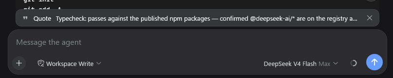

# dsh-client-ui-quote

English | [中文](README.zh.md)

A selection-quoting plugin for the DeepSeek Harness web GUI: select text inside an AI reply and attach it to your next message as a quote banner.

<a href="https://github.com/skyhancloud/dsh-client-ui-quote/stargazers"></a>
<a href="https://github.com/skyhancloud/dsh-client-ui-quote/blob/main/LICENSE"></a>
<a href="https://github.com/skyhancloud/dsh-client-ui-quote/commits/main"></a>
<a href="https://github.com/skyhancloud/dsh-client-ui-quote/releases"></a>

## Table of Contents

- [Features](#features)
- [Preview](#preview)
- [Installation](#installation)
- [Usage](#usage)
- [Development](#development)
- [License](#license)

## Features

- **Selection toolbar** — one 引用 (Quote) button appears above the selection after a 50ms debounce, so it never flashes mid-drag. It hides on Escape, scroll-away, or when the selection collapses.
- **Quote banner** — a removable strip above the composer with a quote glyph, the quoted text, and a × button. The quote is consumed by the next send: the banner clears when the message goes out.
- **Clean draft** — the quote is a pending-send attachment, not text in your input. Focus returns to the composer so typing follows.
- **Localized** — toolbar labels and the quote attribution follow the UI language (中文 / English).
- **Fallback for older harnesses** — on versions without the input-machine quote attachment, the button inserts the quote block at the end of the draft instead.

## Preview




## Installation

### Prerequisites

- DeepSeek Harness with the web GUI (`dsh web`)
- Full banner behavior needs `@deepseek-ai/dsh-client-ui-conversation` with the input-machine quote attachment (`InputActions.setQuote`). Older versions fall back to inserting the quote into the draft.

### Install

```sh
dsh plugin --profile web add https://github.com/skyhancloud/dsh-client-ui-quote
```

Then restart `dsh web` and refresh the browser.

## Usage

1. Select any text inside an AI reply.
2. Click **引用** (Quote) above the selection — the quote appears as a banner above the composer.
3. Type your message and send — the quote is prepended to the outgoing message:

```
> 引用 AI 回复：
> <selected lines>

<your message>
```

4. Click × on the banner when you no longer need the quote.

## Development

```sh
pnpm install
pnpm run bundle   # emits lib/index.js and lib/client.js
```

Pull requests are welcome.

## License

MIT — see [LICENSE](LICENSE).
