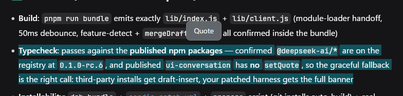

# dsh-client-ui-quote

Selection quoting for the [DeepSeek Harness](https://github.com/deepseek-ai/deepseek-harness) web GUI: select any text inside an AI reply, and a 引用 (Quote) button appears above the selection after a short debounce. Clicking it attaches the selection to the composer as a removable quote banner — a quote glyph, the quoted text, and a close button — without touching your draft. When you send, the quote is prepended to the outgoing message, so the model sees exactly what you are referring to.

## Preview




## Features

- **Selection toolbar** — one 引用 button, always above the selection (clamped to the viewport edge), debounced by 50ms so it never flashes mid-drag; hides on Escape, scroll-away, or when the selection collapses.
- **Quote banner** — a GoalBar-family strip above the composer: quote glyph, quoted text (ellipsis-truncated), and a × remove button. The banner survives sends until closed, and each send carries the quote.
- **Clean draft** — the quote is a pending-send attachment of the input machine, never text in your input; focus returns to the composer so typing follows.
- **Localized** — toolbar labels and the model-visible attribution follow the UI language (中文 / English).
- **Graceful fallback** — on harness versions whose input machine predates the quote attachment, the button embeds the quote block at the end of the draft instead of attaching a banner.

## Install

```sh
dsh plugin --profile web add https://github.com/skyhancloud/dsh-client-ui-quote
```

Then restart `dsh web` and refresh the browser. Selecting text in an AI reply shows the toolbar; 引用 attaches the banner above the composer.

> Requires a harness whose `@deepseek-ai/dsh-client-ui-conversation` ships the input-machine quote attachment (`InputActions.setQuote`) for the full banner experience; otherwise the draft-insert fallback applies.

## Development

```sh
pnpm install
pnpm run bundle   # emits lib/index.js + lib/client.js (tsdown)
```

## License

MIT
